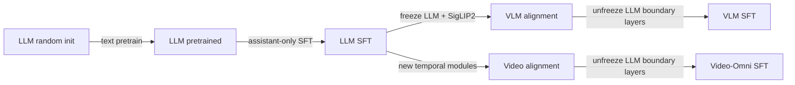

# 00 · 模型训练全景

## 一句话心智模型

模型训练就是：把样本转成张量，让模型产生预测，用目标答案计算误差，再沿着误差方向更新允许训练的参数。

```text
raw sample → tokenizer / processor → tensors → model.forward
           → logits → loss → backward → gradients → optimizer.step
           → checkpoint → held-out evaluation
```

这些名词的职责不能混在一起：

| 对象 | 它保存什么 | 它不负责什么 |
|---|---|---|
| Dataset | 原始样本到单条 tensor 的规则 | 不更新参数 |
| Model | 参数和 forward 计算图 | 不决定训练/测试如何划分 |
| Loss | 预测与目标之间的标量误差 | 不是能力评估的全部 |
| Optimizer | 根据 gradient 更新参数 | 不自动产生 gradient |
| Checkpoint | 某时刻参数及恢复状态 | 不证明模型有效 |
| Evaluation | 在未训练样本上测能力 | 不参与参数更新 |

## 本项目的六阶段继承链



VLM 和 Video-Omni 都继承同一个 LLM SFT，而不是继承彼此。这样可以把“增加一个模态”造成的变化
限制在清晰边界内。

## “从头训练”的准确含义

- LLM 的 63.9M 参数从随机初始化开始预训练；
- VLM projector 从随机初始化训练；
- Video-Omni 的 spatial/temporal adapter 与 projector 从随机初始化训练；
- SigLIP2 使用公开预训练权重并始终冻结。

如果把冻结 SigLIP2 也称为“整个模型完全从零训练”，是不准确的。本项目选择冻结它，是因为 2,900 条
视频不足以训练一个可靠视觉 backbone，而我们的学习重点是语言训练、跨模态对齐与时间建模。

## 六个必须回答的问题

阅读任何训练项目时，先回答：

1. 输入张量是什么形状？
2. 目标 label 在哪里，哪些位置是 `-100`？
3. 哪些参数 `requires_grad=True`？
4. 一个 optimizer step 累积了多少 micro-batch？
5. checkpoint 能否恢复 optimizer 和随机状态？
6. 最终指标是否来自真正分离的测试集？

本 handbook 后续章节就是对这六个问题逐层作答。
