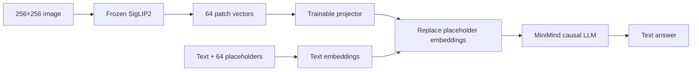

# 03 · VLM：让语言模型读取图像

## 核心难题是空间对齐

LLM hidden vector 和 SigLIP2 patch vector 来自不同模型，即使维度同为 768，语义坐标系也不相同。
Vision Projector 的任务是把视觉向量变换到 LLM 能使用的 embedding 空间。



这里采用 early fusion：视觉 token 与文本 token 一起进入 causal Transformer，而不是额外增加
cross-attention。实现见 [`src/minimind_lab/vlm/model.py`](../src/minimind_lab/vlm/model.py)。

## 两阶段训练的理由

Alignment 阶段冻结 SigLIP2 和 LLM，只训练 1.18M projector 参数。如果一开始就更新整个 LLM，随机
projector 产生的噪声可能破坏已经学到的语言能力。

SFT 阶段仍冻结 SigLIP2，但解冻 projector 与 LLM 第一、最后一层。第一层更靠近输入模态，最后一层
更靠近答案分布，这是一种控制成本和遗忘风险的折中。

## 需要警惕的捷径

VLM 可能完全不看图，只根据问题中的语言先验回答。评估因此包含：

- 图片与问题匹配的正常测试；
- caption、VQA、OCR-like、计数和幻觉样例；
- 纯文本 LLM 回归测试；
- 失败输出，而不仅展示成功图片。

参数冻结测试：

```bash
uv run pytest tests/test_vlm.py
```
