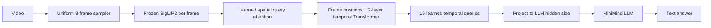

# 04 · Video-Omni：从图像理解到时序理解

## 视频不是“多放几张图片”

如果把每帧特征直接求平均，`A → B` 和 `B → A` 会得到同样结果，模型无法回答“先发生了什么”。
Video-Omni 必须保留帧内空间信息和帧间顺序。



## 三个关键模块

1. Spatial query-attention：对一帧的 patch token 做可学习汇聚，比简单 mean pooling 更能保留物体位置；
2. Temporal Transformer：加入 learned frame position 后在 8 帧之间做 self-attention；
3. Query resampler：用 16 个 learned query 提取固定数量的视频 token，让 LLM 输入长度稳定。

正式模型共 178,569,984 参数，其中 SigLIP2 94,552,320 参数冻结。Alignment 训练 20,105,472
参数；SFT 训练 34,854,528 参数。实现见
[`src/minimind_lab/video/model.py`](../src/minimind_lab/video/model.py)。

## 为什么要倒序评估

对静态问题，“把帧倒过来”可能不影响正确答案；对方向和先后问题，正确语义应该反转。因此我们同时做：

- QIVD 真实 held-out 视频的正常/倒序对照；
- 160 条程序化受控视频：左右、上下、变大/变小、红方块/蓝圆先后；
- 正常 loss 与倒序 loss；
- 正常 token F1 与倒序 token F1；
- 回答变化率和逐类结果。

若 normal-minus-reversed 不为正，必须得出“尚未建立时序敏感性”，不能因为文本看起来流畅就说成功。

验证架构与基准：

```bash
uv run pytest tests/test_video_omni.py tests/test_temporal_benchmark.py
uv run python scripts/generate_temporal_benchmark.py
```
