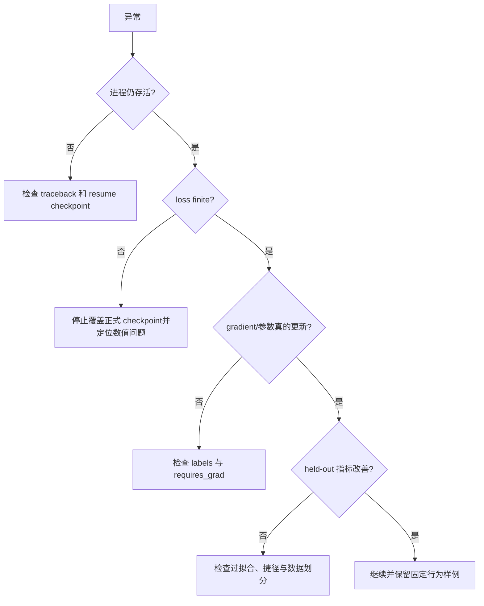

# 08 · 读日志与排错

## 一条训练日志

```json
{
  "step": 12000,
  "loss": 3.12,
  "grad_norm": 0.47,
  "seconds_per_step": 0.41,
  "learning_rate": 0.00049
}
```

逐项解释：

- `step`：micro-step，不一定执行了 optimizer update；
- `loss`：当前 micro-batch 的未除 accumulation 原始 loss，短期波动正常；
- `grad_norm`：最近一次更新前的 global norm；
- `seconds_per_step`：从本次进程开始计算的平均 micro-step 时间；
- `learning_rate`：当前 optimizer group 的学习率。

## 常见现象

| 现象 | 优先检查 | 不要立即做什么 |
|---|---|---|
| loss 偶尔升高 | batch 难度、总体趋势 | 立刻重启训练 |
| loss 为 NaN/Inf | 输入、学习率、AMP、梯度 | 继续覆盖 checkpoint |
| grad norm 长期为 0/None | label 是否全 `-100`、参数是否冻结 | 盲目增大学习率 |
| 吞吐突然下降 | 同机进程、内存压力、数据解码 | 直接改变模型规模 |
| validation 好、生成复读 | 评估分布、解码方式、数据重复 | 只汇报 validation loss |
| 倒序与正常完全相同 | frame position、数据是否真有时序 | 宣称视频理解成功 |

## 诊断顺序



## 恢复前检查

1. 确认没有原训练 PID；
2. 确认 `.resume.pt` 存在且非零；
3. 使用相同 config 与 `--resume`；
4. 日志应明确打印恢复 step；
5. 第一个新 step 应大于保存 step，而不是从 1 重新开始。

仓库中的 lock、atomic save 和 artifact verifier 可以降低风险，但不能替代阅读 traceback 与理解数据。

运行 `uv run python scripts/snapshot_progress.py` 可把各阶段本地 console log 提炼为
[`reports/training-progress.md`](../reports/training-progress.md)。该报告只包含聚合进度和 loss，不上传
原始逐步日志、数据或权重。
